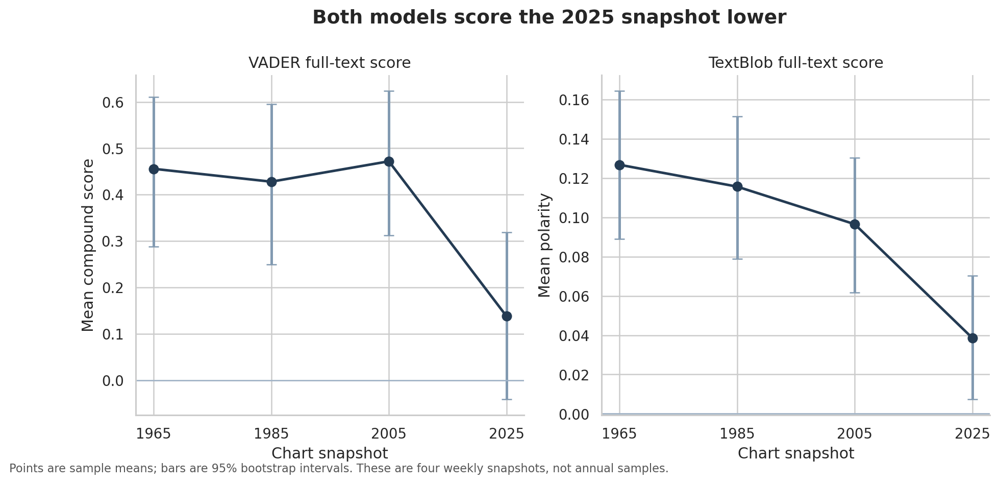
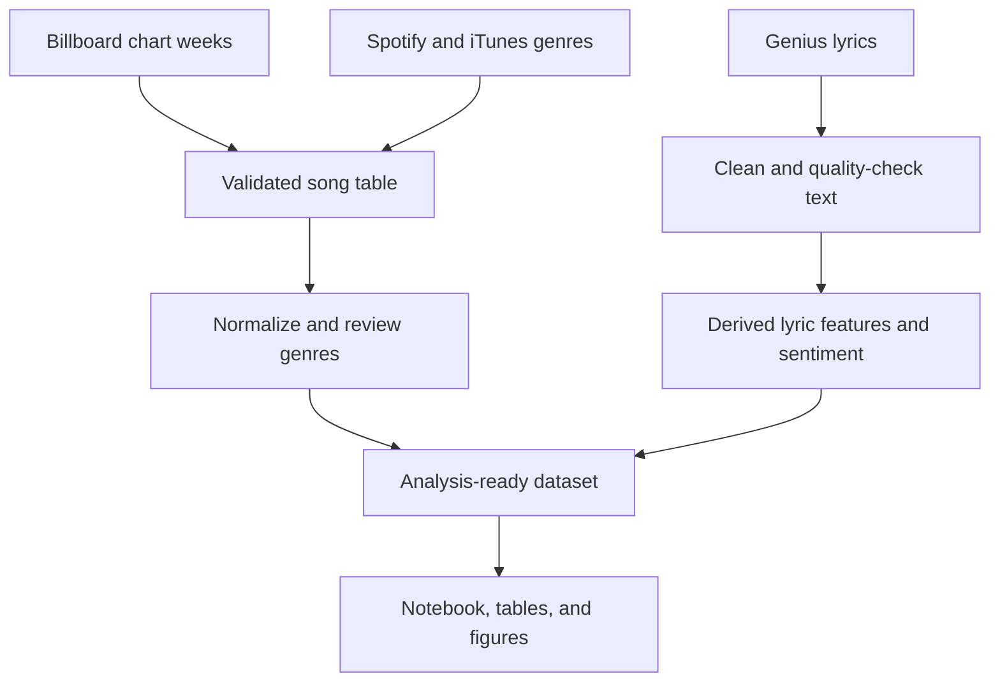

# Off the Chart

### What can four Billboard Hot 100 chart weeks tell us about lyrics across 60 years?

This project compares the songs listed on four Billboard Hot 100 charts: August 28, 1965; August 24, 1985; August 27, 2005; and May 3, 2025. It combines chart positions, artist genres, Genius lyrics, two sentiment models, and data-quality checks in a reproducible Python workflow.

The main result is a signal worth investigating, not a claim about all music. Both VADER and TextBlob give the 2025 chart week a lower average sentiment score than the three earlier snapshots. The models also agree on the exact positive, neutral, or negative label for only 49% of the 2025 songs. That disagreement is an important warning against treating automated sentiment as ground truth.

[View the complete analysis notebook](notebooks/off_the_chart_analysis.ipynb)



## Results at a glance

| Chart week | Songs on file | Lyrics scored | Mean VADER | Mean TextBlob | Model agreement |
|---|---:|---:|---:|---:|---:|
| 1965-08-28 | 100 | 89 | 0.456 | 0.127 | 67% |
| 1985-08-24 | 100 | 94 | 0.428 | 0.116 | 64% |
| 2005-08-27 | 100 | 95 | 0.472 | 0.097 | 62% |
| 2025-05-03 | 99 | 99 | 0.138 | 0.039 | 49% |

Compared with the earlier snapshots pooled together, the 2025 mean is lower by 0.314 VADER points (95% bootstrap interval: -0.517 to -0.117) and 0.074 TextBlob points (-0.112 to -0.037). These intervals describe variation among songs in the selected charts. They do not turn four weekly charts into representative annual samples.

The conclusion stays similar after weighting songs by chart rank. The rank-weighted VADER mean is 0.131 in 2025, compared with 0.413, 0.419, and 0.449 in the earlier snapshots.

## What this project demonstrates

- A multi-source data pipeline joining Billboard charts, Spotify/iTunes genre metadata, and Genius lyrics.
- Text cleaning that removes Genius page material while preserving capitalization and punctuation used by sentiment models.
- Auditable genre normalization: the source genre remains in the data, automated rules create broad categories, and corrections live in a separate override table.
- Two-model NLP analysis with bootstrap intervals, rank-weighted sensitivity checks, and explicit model-agreement reporting.
- Automated checks for missing ranks, duplicate keys, missing lyrics, missing genres, and suspicious lyric text.
- A public derived dataset that does not expose full copyrighted song lyrics.

## Data pipeline



## Repository structure

```text
off-the-chart/
├── data/
│   ├── raw/charts/             # Four source chart snapshots
│   ├── interim/genres/         # Retrieved genre metadata
│   ├── private/                # Local-only full lyrics and original scores
│   ├── processed/              # Public derived features and summaries
│   └── reference/              # Documented genre corrections
├── docs/                       # Portfolio copy, resume bullets, data dictionary
├── notebooks/                  # Executed portfolio notebook
├── reports/figures/            # Reproducible visualizations
├── scripts/                    # Acquisition, build, and analysis commands
├── src/offthechart/            # Reusable cleaning and analysis code
└── tests/                      # Unit tests for core transformations
```

## Run it locally

Python 3.12 is recommended. In VS Code, select the `.venv` interpreter as the notebook kernel after setup.

```bash
python3.12 -m venv .venv
source .venv/bin/activate          # Windows: .venv\Scripts\activate
python -m pip install --upgrade pip
python -m pip install -r requirements.txt
python -m ipykernel install --user --name off-the-chart --display-name "Python (off-the-chart)"
```

Run the project:

```bash
python scripts/build_features.py
python scripts/analyze_results.py
python -m pytest -q
```

The included processed outputs let readers run the notebook without raw lyrics or API credentials. Rebuilding the features requires the local lyric files described in `data/private/README.md`. Fresh data acquisition also requires the credentials listed in `.env.example`.

## Method notes

The supplied sentiment files are retained as the project's original full-text baseline. Whole-song VADER scores are unusually extreme: 72% to 84% of songs in each snapshot have an absolute compound score of at least 0.9. VADER was designed for short social-media text, so the refactored code also includes a line-level scoring method for a future rescrape. The notebook does not mix that unexecuted method with the reported baseline results.

Genre summaries use a minimum of five songs before interpreting a genre-level mean. Smaller groups remain in the output table but are marked as too small for comparison.

## Limitations

- Each year is represented by one chart week, so the project compares selected snapshots rather than measuring a continuous 60-year trend.
- The 2025 source file contains 99 positions and is missing rank 100.
- Lyric retrieval coverage varies from 89% to 100%, which can introduce selection bias.
- Automated genre matches can be wrong. The project records 26 reviewed corrections and keeps the original API values.
- Sentiment tools can miss sarcasm, narrative context, slang, negation across long passages, and changes in language over time.
- A lower sentiment score does not explain why language differs and should not be treated as evidence of a cultural or mental-health shift.

## Sources and responsible use

Chart pages: [1965](https://www.billboard.com/charts/hot-100/1965-08-28/), [1985](https://www.billboard.com/charts/hot-100/1985-08-24/), [2005](https://www.billboard.com/charts/hot-100/2005-08-27/), and [2025](https://www.billboard.com/charts/hot-100/2025-05-03/). Genre metadata came from Spotify and iTunes searches where available. Lyrics were retrieved from Genius for analysis.

Full lyrics are excluded from version control. Only derived numerical features and limited metadata are intended for the public repository. The MIT license covers this project's code and original documentation, not third-party data or lyrics.
